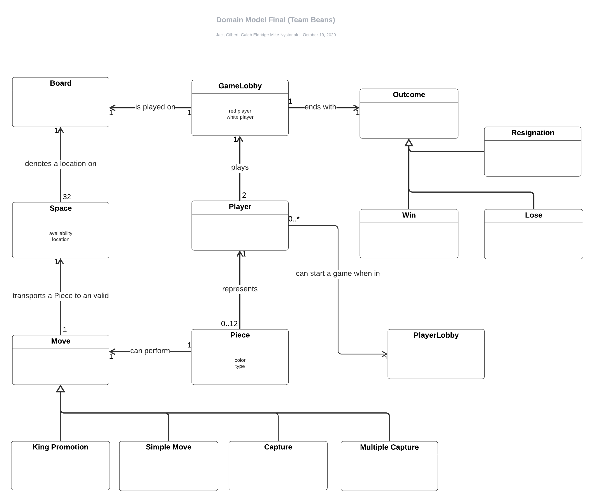
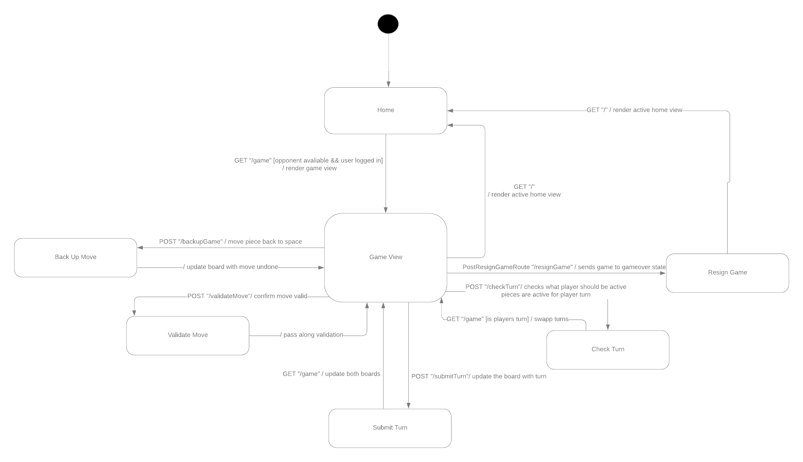
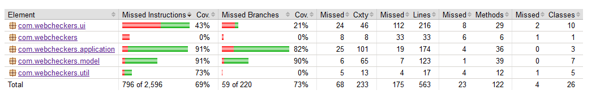

# WebCheckers Design Documentation

## Team Information
* WebCheckers Team: Beans (s2c)
* Team members
  * Jack Gilbert - Team Coordinator
  * Mike Nystoriak - Quality Coordinator
  * Aaron Segal - Team Member
  * Caleb Eldridge - Team Member

## Executive Summary

A webserver was created to bring checker players together into a web based interactive experience.
Upon signing in, the user can see a list of all potential opponents with whom they can challenge to a game of checkers.
Once the game begins, the user is brought to a view of a generic checkers game board oriented towards their perspective.
A complete checker game can be played in accordance to the American Rules of Checkers; available jumps must be taken, multiple jumps
must be completed, and the player may resign on their turn at any time.
Upon completion of the game, the user will have an opportunity to review their past games, as well as any relevant statistics.
A user will also be able to play multiple games at once. 

### Purpose

The main goal of this project is to create an easy to use web application that allows users to play a simple game of
checkers against other users on the server. The player is able to easily manipulate the checkers pieces with the mouse
to move it to each position on the board. This program allows players to use several American Checker concepts such as
single jumps, double jumping, king pieces, etc. The user can then watch replays of past games once the game ends as well
as play multiple instances of a checkers game against several opponents.

### Glossary and Acronyms

| Term | Definition |
|------|------------|
| Player | Person that does any action |
| User | Someone using the WebCheckers application |
| Game | The instance of the checkers board |
| MVP | Minimal Viable Product |
| Inactive Home View | The landing view of the WebCheckers Application when the user is not signed in|
| Active Home View | The landing view of the WebCheckers Application when the user is signed in |
| Game View | The view of the game board from the player's perspective |
| Move | A single diagonal move made by a checker piece |
| Capture | The removal of an opponent's piece |
| Domain | The High-Level goals of the application |
| Domain Object | An item or concept related to the domain |

## Requirements

The following section will describe the planned or already implemented features of our application.

### Definition of MVP
The MVP for this project lies within several features the client wants us to implement. The user must have the ability
to sign in and out on most pages of the application. The user must also be able to challenge and have the capability to
be challenged to a game of checkers. The user will then be able to perform moves and actions that relate to the American
standard rules of checkers. The player or opponent may resign at any time during the game's runtime and then return to the home page. 
Lastly, the user must be able to review their past games in replay mode, and be able to play multiple games at once.

### MVP Features
* User Sign-in/out
* Start a Game 
* Simple Move
* Capture & MultiCapture
* King Me
* Player Resignation
* Game Over

### Expected Vision for Enhancements
1. Replay Mode
    * A reviewable version of a prior checkers game that allows the user to step back and forth
    through the game's moves.
    * Replays will be accessible only by the two players that participated in the game recorded.
2. Multi-Game Mode
    * A user will be able to have several active games going on at once.
    * Users will be able to go to and from each active game as they please.
    * Each game will continue until one of the players win and lose, and then the game session is set to inactive.
3. Statistics
    * This will be a collection of data about the game's attributes.
    * This includes items such as captures, moves made, winner and loser, and several other game statistics which can be collected.
4. Draw
    * This feature will handle scenarios when gridlock occurs and no possible move can be made.
    * It will also handle scenarios where players are simply chasing one another's pieces.

### Changed Requirements
* Currently, no requirements had to be modified.
    * Client only requested development of already planned items decided by the team.

## Application Domain

Below is the team's final version of the Domain Model

The domain for a checkers game application pertains mostly to that of regular checkers. We can see in the diagram how 
pieces move on spaces, spaces are spots on a board and boards make up the game.
Generally for this application we want to just look at our game domain. The game is the central part of our domain, for
it is where all the logic and components are held to play checkers. Every component here is related to the game
domain object. The player plays a game and almost every other domain object makes up the game (or denotes an outcome of the game).

Major Interaction:
* Player and PlayerLobby
    * When the player logs in, they are added to the player lobby.
    * From the player lobby they are available to be challenged to a game of checkers. 
* Player and GameLobby
    * When the player is challenged, they are assigned to a game lobby with the opponent.
    * The game lobby manages most player vs. player interactions during an active game.

## Architecture and Design

This section goes into detail about the Architectural and Design decisions the team decided upon during development.

### Summary

The following Tiers/Layers model shows a high-level view of the webapp's architecture.

As a web application, the user interacts with the system using a
browser.  The client-side of the UI is composed of HTML pages with
some minimal CSS for styling the page.  There is also some JavaScript
that has been provided to the team by the architect.

The server-side tiers include the UI Tier that is composed of UI Controllers and Views.
Controllers are built using the Spark framework and View are built using the FreeMarker framework.  The Application and Model tiers are built using plain-old Java objects (POJOs).

Details of the components within these tiers are supplied below.

### Overview of User Interface

This section describes the web interface flow; this is how the user views and interacts
with the WebCheckers application.

When the user first connects, they are greeted by a home splash screen featuring the ability to sign-in, and the total
number of current users using WebCheckers. This is the "inactive" home view (no user logged in). The user then can go
to the login page which asks for a valid username. Once the username submitted, the user is sent back to an active
home page state where they can then challenge active opponents to a game of checkers. When a player is challenged, both
the challenger and the one challenged is sent to a new checker game board where they perform moves on a checker board.
When the game is over, both users are sent back to the home page and are able to challenge users once again. There will
also be the option to go to a statistics page which will have your cached replays and account info. The user can log-out
at any time in the stats, home and game view and you will be sent to an inactive home page.

### UI Tier

The UI tier of our application handles all operations dealing with rendering of page info and of presenting the several
views we have implemented in terms of the checkers game application. 

It uses a combination of several GET and POST routes to handle client interaction with the webserver.

1. At the start of this tier's usage, it is the GetHomeRoute. This route renders the home page in an active or inactive
state depending on if a user signs in.
2. Then when the user presses the sign in button, it renders a page through the GetSignInRoute where the user can input
a username.
3. When the name is submitted, our PostSignInRoute handles rendering the signin page with an error, or sends the user
back to the home page in an active state.
4. The user can then challenge a player. This utilizes our GetGameRoute which sends both players to an active Checkers
game with both players competing against each other.
5. Each player can then employ several routes at this point. When they make a move it uses our PostValidateMoveRoute
to make sure the move they made was valid (if not valid it will render an error message) 
and then we have the PostSubmitTurnRoute which sends the move to the actual board to update for both players.
6. We also have the PostCheckTurnRoute which manages the swapping of turns between the two players. It also renders a 
message at the top of each player's board which displays if it's their turn to make a move.
7. Also, at any time when it's a player's turn, they can use the backup button (which uses our PostBackupMoveRoute) which
renders the piece that was just moved back in its original spot before the move was made.
8. There is also one more Route that handles if a user presses the resign button (PostResignGameRoute). This route causes
the checkers game page to render an exit button that will allow the players return to the homepage when pressed. 

**Below is an example of one of our more complicated routes, our GetGameRoute!**

### Application Tier

Our application tier handles most of the player & user information storage classes. Most functions in the application 
apply to the users and board management. 
 
Currently, it has the following classes:

* PlayerLobby
    * Contained all user that log into the WebCheckers application.
    * Allows user to sign in with a preferred username with some conditions pertaining to validity of the username.
    * If the username is not valid it asks for a new name.
    * Allows for the home page to access the number of current users logged in.
    * Sign out functionality will remove the player from the hashmap that is the Player Lobby.
    
* GameLobby
    * Contains creation of game sessions for users and the deletion of the game session.
    * Builds game sessions using generated keys allowing for multiple games for one user to be made.
    
* TurnServices
    * Handles management of turn swapping between two players in a game.
    * Developed due to Law of Demeter concerns dealing with prior architecture of turn management.
        * Several distant classes had to interact with our GameLobby to swap turns between players.

**An overview of our application tier can be found below!**

### Model Tier

The model tier handles most of the core game objects and general logic. The domain entities within this tier are used
by the other two tiers to create a seamless checker game application. The domain entities in this board pertain to
most of the checkers board logic and piece logic. 

* BoardView
    * Handles generation of a board of spaces, these spaces then have pieces associated with them.
    * The board update (when a piece is moved/captured) logic is also handled here.
    * Handles the determination of how many pieces each team has on the current Broadview.
    
* Game
    * The Newest architectural change to the model tier.
        * We had large concerns about the overbearing responsibility that GameLobby contained.
        * We decided to move most actual checkers game functionality and interaction to its own class to satisfy 
        single responsibility concerns.
    * Stores the start and end positions of a move as positions.
    
* Move
    * Any move that has a Row and a Cell that was done by a Player.
    * Stores the start and end positions of a move as positions.
    
* Piece
    * Used for representing the objects on the squares of a checker board.
    * Can either be a single or a king, default is a single.
    * Has a color of Red or white depending on what team the piece is on.
    
* Player
    * This is any user that challenges, or is challenged by someone and is brought to a checkers game.
    * Used to determine who to place in what game instance.
    * Used to see grab a player when challenged.
    * Stores most data pertaining to a single user in or outside a game.
    
* Position
    * Used to represent a combination of a Row and a Cell index.
    
* Row
    * Several Rows are used to construct a checker board.
    * Each row has spaces in them.
    
* Space
    * represents a single spot on a checkerboard.
    * Either has a piece on it or does not.
    * Space is valid if piece is not on it, invalid if there is a piece on it.
    * Allows for pieces to move between different spaces.

### Design Improvements

#### Single Responsibility and High Cohesion Concerns
* We had several scenarios where methods that pertain to one object were strewn about in different classes.
* We decided we wanted to address this by developing/removing additional application and model tier services and applications.
* This lead to the removal of MoveServices and implementation of TurnServices.
* Development of the Game Model tier object stemmed from the lack of single responsibility of the GameLobby class.
    
#### Controller Concerns
* Our team made sure to modify the GameLobby to actually act as a lobby now.
* We made sure to remove most of the game handling and have the gamelobby just manage the two players in one class.

#### Law Of Demeter Concerns
* We had very few law of demeter issues at the end of development.
* Our team made minor changes to our PostResignGameRoute as to remove unnecessary talking to distant neighboring classes.
    * We removed the need to access player data and just focus on getting information from the gamelobby.

#### Information Expert Concerns
* We found that most of the code in MoveServices could simply be moved to the model tier component Move.
* Our team decided that to improve our use of the Information Expert Principle, MoveServices' methods had to be moved to the Move and Game
model tier entities.

#### Inheritance, Polymorphism, and Liskov Concerns
* Our design suffers from very minute to lack of use of these 3 major design principles.
* The team plans to tackle this issue by eventually modifying how certain model tier entities are created.

#### Future Plans
* Given time, our team hopes to eventually work on implementing more inheritance into our design.
* Currently, expandability requires some modification of code which may impact future development.

## Unexpected Requests

The client has requested that several excess features be added to the already planned enhancements.
First the client has requested a replay controller with the ability to pause/play and automatically step through checkers game replay. 
Second the client would like to have a multiple games open in separate windows at the same time, as well as a quick way to navigate between the active games.

Given the time constraints the team will have to consider which features are feasible before the deadline.

## Testing

Testing for the WebCheckers application was done using the JUnit testing package, in which we set up several tests for
each class in our application. We made sure to test all tiers of our application (model, ui, application). Testing was used
to verify the functionality of each developed feature before it was merged into the project's master branch. We set up general use case tests
in which we tested and compared the expected and the actual results of the test.

Our general testing work flow followed this pattern:

Testing allowed us to uncover several bugs which stopped development for quite some time. Two such bugs are documented below.

Issue: Ajax error for Piece [Object object] when piece placed on occupied space.

Fix: Had to fix how we assigned validity of spaces.

Issue: Piece could be placed an infinite distance vertically on board.

Fix: Added vertical distance tracking, to prevent this action.

Code metrics and more information about our unit test making can be found below. 

### Acceptance Testing

Current Number of User Stories Tested: 25

Current Number of User Stories Passing Tests: 25

Acceptance tests failing: None

Issues to Report: None

### Unit Testing and Code Coverage

Our strategy for testing code was as follows:

* We followed a bottom-up methodology where we tested the core components which the game requires for core function. 
    * This included most of the model tier items, and a few application tier items.
* Tests would follow the CuT scheme described in class.
* Tests must be verified by one or more other teammates.
* Tests are to be checked after each merge into the master branch.
    
**Coverage Target**

Our team decided that 75-80% was a good amount of coverage for most classes. However, we preferred higher percentages for
core classes such as most of the model and application tier classes. We decided upon this value because we know that most of
the core functionality is tested in the first 50% and getting higher percents can detract time away from development work.

A picture of our current coverage can be found below!

As you can see in our coverage, we have substantial testing in our model and application tiers.
However, our group had difficulty testing the ui tier, and more extensive testing will have to be done in the future
sprints. We see a large 90% coverage in both the model and application while the ui tier sits at a 43% coverage.
More tests must be developed to cover this large gap in coverage %.

## Code Metrics